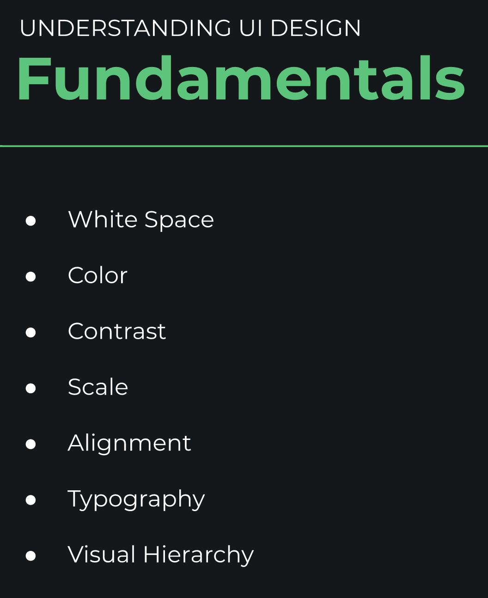

= css-examples image:https://travis-ci.org/daggerok/css-examples.svg?branch=master["Build Status", link="https://travis-ci.org/daggerok/css-examples"] image:https://github.com/daggerok/css-examples/workflows/CI/badge.svg["CI", link="https://github.com/daggerok/css-examples/actions"]

//tag::content[]

reference:

- link:https://www.youtube.com/watch?v=6zGTxITQkN0&t=0s[YouTube: Super Lightweight Scroll Animations with Sal.js - 2.8kb!]
- link:https://en.parceljs.org/recipes.html#bootstrap-+-fontawesome[Parcel Bundler + Bootstrap 4 + Font Awesome]
- link:https://github.com/parcel-bundler/parcel/issues/1080#issuecomment-584745016[Parcel Bundler copy static resources assets files]
- link:https://daggerok.github.io/css-examples[Project reference documentation]

_ui / ux "must have" topics_

- color & contrast
- white space
- visual hierarchy
- complexity cs simplicity
- consistency
- scale

_css "must have" topics_

- css selectors
- css properties
- css values
- css units: `css-property: valu e{unit}`
  . absolute: mm, cm, px, in, pt, pc
  . relative: %, em, rm, vw, vh, vmin, vmax
- css multiple selectors
- css functions:
  . rgba: `background-color: rgba(0,0,0,0.4)`
  . calc: `margin: calc(2em * 5em)`
  . ...
- css animations
  . animation
  . keyframes
  . `transitions` between 2 css values
- css media queries
  . `@media only screen and (min-width: 650px) { /* scoped css rules... */ }`
- css selectors weight
  . by element selector == 1
  . by class name selector == 100
  . by id selector == 1000

_other repositories_

- link:https://github.com/daggerok/flex-box[Flexbox]
- link:https://github.com/daggerok/css-grid[Css Grid]
- link:https://github.com/daggerok/vue-bulma-parcel-playground[GitHub: daggerok/vue-bulma-parcel-playground]
- link:https://github.com/daggerok/tachyons-example[GitHub: daggerok/tachyons-example]
- link:https://github.com/daggerok/css-grid-layout-example[GitHub: daggerok/css-grid-layout-example]
- https://github.com/daggerok/html-footer

Initially generated by using link:https://github.com/daggerok/generator-jvm/[generator-jvm] yeoman generator (java-parent-multi-project)

//end::content[]
